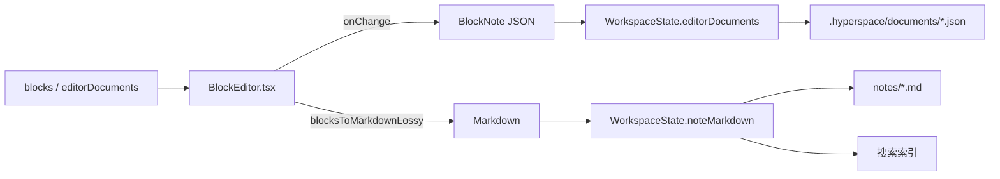
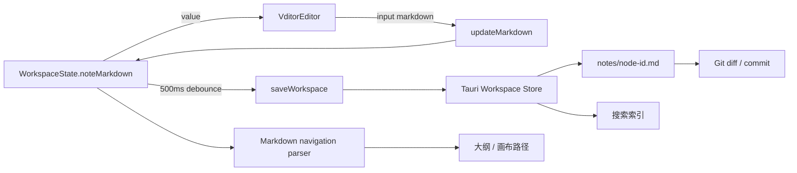
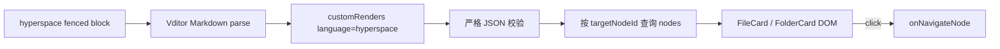

# HyperSpace 编辑器切换至 Vditor 技术设计

## 1. 文档信息

- 状态：提案
- 目标版本：下一编辑器迁移版本
- 变更范围：React 编辑器层、工作空间正文状态、编辑器相关样式与依赖
- 不变范围：Tauri 工作空间目录、Markdown 文件格式、搜索索引、Git 与 Git LFS 能力
- 上游项目：[Vditor](https://github.com/vanessa219/vditor)

## 2. 背景与目标

当前正文编辑器基于 BlockNote，运行时同时维护三种正文表示：

1. `blocks`：早期 HyperSpace 块模型；
2. `editorDocuments`：BlockNote JSON 文档；
3. `noteMarkdown`：用于文件保存、搜索和 Git diff 的 Markdown。

这种结构使编辑器实现、迁移逻辑和持久化逻辑都依赖 BlockNote 数据模型，并存在 JSON 与 Markdown 内容漂移的可能。本次改造将正文编辑器切换为 Vditor，以 Markdown 作为编辑器输入、输出和持久化的唯一规范格式。

### 2.1 目标

- 使用 Vditor 替换 BlockNote，默认采用即时渲染 `ir` 模式。
- 保留所见即所得、分屏预览和即时渲染三种模式的切换能力。
- 保持当前 500ms 工作空间防抖保存、离线编辑、只读锁定、搜索和 Git diff 行为。
- Markdown 内容在编辑器、应用状态和 `notes/<node-id>.md` 之间无额外格式转换。
- 支持标题、列表、任务列表、表格、代码块、数学公式、链接、图片、Mermaid 与 GFM。
- 应用断网时可完整启动和编辑，不依赖 Vditor 默认 CDN。
- 旧工作空间首次打开后通过独立迁移器转成 Markdown；应用运行时、依赖和构建产物中不保留 BlockNote。
- 文件和文件夹卡片使用 HyperSpace Markdown 扩展，并通过与 Mermaid 相同类型的自定义渲染阶段生成交互卡片。

### 2.2 非目标

- 本次不实现多人实时协同编辑。
- 本次不实现图片远程上传服务；图片上传按钮默认隐藏，后续接入 Tauri 附件导入命令。
- 本次不复刻 BlockNote 的块拖拽手柄和所有浮动菜单交互。
- 本次不改变 Markdown front matter、节点 sidecar、搜索索引或 Git 存储结构。

## 3. 现状分析

### 3.1 当前编辑链路



风险包括：

- `blocksToMarkdownLossy` 对自定义块和部分样式是有损的。
- 大纲、画布路径和滚动定位依赖 BlockNote block ID，无法直接复用于 Vditor。
- Vditor 默认使用远程 CDN 动态加载渲染资源，不符合桌面端离线要求。
- Vditor 默认启用 LocalStorage 缓存，若不关闭会形成第三个写入源。

### 3.2 受影响代码

| 文件 | 当前职责 | 设计动作 |
| --- | --- | --- |
| `src/BlockEditor.tsx` | BlockNote schema、工具栏、自定义块、正文编辑 | 迁移实现合入时直接删除 |
| `src/App.tsx` | 编辑器装载、Markdown/JSON 双写、大纲与画布路径 | 改为 Markdown 单写及 Markdown 派生导航 |
| `src/types.ts` | `blocks`、`editorDocuments`、`noteMarkdown` | 保留旧字段为迁移输入，新增 schema 版本说明 |
| `src/storage.ts` | Web/Tauri 工作空间读写 | 写入前规范化，迁移完成后不再生成编辑器 JSON |
| `src/styles.css` | BlockNote 样式覆盖 | 替换为 `.hyperspace-vditor` 范围样式 |
| `src-tauri/src/workspace_store.rs` | Markdown 文件、document sidecar、旧格式回退 | Markdown 成为唯一正文；兼容读取旧 sidecar |
| `src/hyperspaceEmbeds.ts` | 不存在 | 新增卡片语法解析、插入与安全渲染 |
| `package.json` | BlockNote/Mantine/TipTap 依赖 | 新增 `vditor`，同一次变更中移除全部旧编辑器依赖 |

## 4. 关键设计决策

| 决策 | 结论 | 原因 |
| --- | --- | --- |
| 正文规范格式 | UTF-8 Markdown | 与工作树、搜索、Git diff 和 Vditor 原生接口一致 |
| 默认编辑模式 | `ir` | 接近当前沉浸式编辑体验，同时保留 Markdown 语义 |
| 编辑器缓存 | `cache.enable = false` | 防止 Vditor LocalStorage 与 WorkspaceState 双写冲突 |
| 资源加载 | npm 固定版本并将 `vditor/dist` 复制为本地静态资源 | Tauri 离线运行，避免运行期依赖 unpkg |
| 状态回调 | `onChange(markdown)` | 移除编辑器私有 JSON 对上层的泄漏 |
| 外部值同步 | page 切换重建；同页外部变更调用 `setValue(value, true)` | 避免 input 回调回环并清空跨文档撤销栈 |
| 只读模式 | `disabled()` / `enable()` | 使用 Vditor 公共 API，不依赖 DOM 属性修改 |
| 销毁方式 | React effect cleanup 调用 `destroy()` | 防止页签切换后监听器和 DOM 残留 |
| 工作空间卡片 | `` ```hyperspace `` fenced block + 版本化 JSON | 与 Mermaid 的“源码块 → 自定义渲染”机制一致，可编辑、可迁移且不会混入任意 HTML |
| 旧编辑器处置 | 一次性迁移后彻底移除 | 不保留双引擎、运行时依赖或回滚开关，避免长期维护两套编辑器 |
| 大纲来源 | 从 Markdown 解析标题 | 不绑定 Vditor 私有 DOM 或内部 AST |

## 5. 目标架构



编辑器不直接调用 Tauri 保存命令。React 工作空间状态仍是 UI 会话内的协调层，Rust Core 仍是磁盘写入边界。

## 6. React 组件设计

### 6.1 组件接口

新建 `src/VditorEditor.tsx`：

```ts
export interface HyperSpaceVditorProps {
  pageId: string;
  value: string;
  nodes: ContentNode[];
  readOnly: boolean;
  theme: "light" | "dark";
  onChange: (markdown: string) => void;
  onNavigateNode: (nodeId: string) => void;
  onActiveHeadingChange?: (headingId: string | null) => void;
  onCursorChange?: (position: { line: number; column: number }) => void;
}
```

`nodes` 通过 ref 提供给卡片渲染器。节点标题、路径或子项变化时只重新渲染 `.hs-embed-card`，不得重建 Vditor 实例。`onNavigateNode` 同样通过 ref 保持最新回调。

### 6.2 生命周期

1. `pageId` 变化时创建新的宿主元素和 Vditor 实例。
2. 初始化参数使用 `value`、`lang: "zh_CN"`、`mode: "ir"`、`cache.enable: false`。
3. `after` 回调设置 ready 状态，应用只读状态和当前主题。
4. `input(value)` 只向上抛出 Markdown，不直接保存磁盘。
5. 同一页面收到外部 `value` 时，仅在 `value !== instance.getValue()` 时调用 `setValue(value, true)`。
6. `readOnly` 变化时调用 `disabled()` 或 `enable()`。
7. 主题变化时调用 `setTheme()`；不重建编辑器。
8. effect cleanup 调用 `destroy()`，并清空实例引用。

为防止 `setValue` 触发 `input` 后形成状态回环，组件设置 `applyingExternalValueRef`；外部同步完成前忽略一次相同内容回调。

### 6.3 建议初始化配置

```ts
new Vditor(host, {
  value,
  mode: "ir",
  lang: "zh_CN",
  height: "auto",
  minHeight: 320,
  cache: { enable: false },
  toolbarConfig: { pin: true },
  toolbar: [
    "headings", "bold", "italic", "strike", "|",
    "list", "ordered-list", "check", "quote", "|",
    "code", "inline-code", "link", "table", "|",
    "undo", "redo", "edit-mode", "both", "preview", "outline"
  ],
  preview: {
    delay: 300,
    maxWidth: 700,
    hljs: { enable: true, lineNumber: true, style: "github" },
    math: { engine: "KaTeX" }
  },
  customRenders: [hyperSpaceEmbedRenderer]
});
```

具体 TypeScript 字段以安装版本自带类型声明为准。不得通过 `any` 绕过错误配置。

### 6.4 防抖职责

- Vditor `input`：立即更新 React 状态，保证大纲、搜索回退和页签切换看到最新正文。
- `App` 保存 effect：继续使用现有 500ms 防抖写盘。
- Vditor preview：独立使用约 300ms 渲染延迟。
- 不在编辑器组件内增加第二层保存防抖。

## 7. Markdown 数据模型与迁移

### 7.1 目标状态

`WorkspaceState.noteMarkdown` 是唯一可写正文：

```ts
interface WorkspaceState {
  nodes: ContentNode[];
  tags?: TagDefinition[];
  noteMarkdown: Record<string, string>;
  selectedNodeId: string;
  lastSavedAt?: string;
}

interface LegacyWorkspaceInput extends Omit<WorkspaceState, "noteMarkdown"> {
  noteMarkdown?: Record<string, string>;
  blocks?: Record<string, NoteBlock[]>;
  editorDocuments?: Record<string, unknown[]>;
}
```

不要把 `Vditor.exportJSON()` 结果写入工作空间。该 JSON 仅允许在调试或无持久化的派生计算中使用。

### 7.2 读取优先级

每个页面按以下顺序解析初始 Markdown：

1. `noteMarkdown[nodeId]`；
2. `.hyperspace/documents/<node-id>.json` 中的 `markdown`；
3. `notes/<node-id>.md` 去除 HyperSpace front matter 后的正文；
4. 将旧 `blocks[nodeId]` 确定性转换为 Markdown；
5. 对仅存在 `editorDocument` 的异常旧数据执行保守文本恢复，并记录迁移警告。

当前存储层已经在 document sidecar 中写入 `markdown`，正常升级路径不会走到第 5 级。

### 7.3 写入策略

- 新版本只更新 `noteMarkdown`。
- `notes/<node-id>.md` 继续写入 front matter 和 Markdown 正文。
- 文件树扫描得到的真实 `.md` / `.markdown` 文件同样映射到 `noteMarkdown[filesystemNodeId]`，选择后复用 `NoteView` 与 Vditor；保存时安全校验相对路径并原位回写该文件，不复制到 `notes/`。
- `.hyperspace/documents/<node-id>.json` 只保留 `markdown` 与格式版本，不再写入 `editorDocument`。
- 独立迁移器只解析已知旧 JSON 字段，不导入、实例化或保留任何 BlockNote 包。
- 迁移开始前将旧 sidecar 原样复制到 `.hyperspace/migrations/pre-vditor/<timestamp>/`；迁移成功并完成原子写入后，从活动工作空间状态和 document sidecar 中删除 `blocks`、`editorDocument`、`editorDocuments`。
- 迁移失败时阻止覆盖该页面，展示恢复提示和备份路径；不得以空 Markdown 继续保存。

### 7.4 HyperSpace 卡片语法

文件和文件夹使用单一的 fenced Markdown 扩展：

````markdown
```hyperspace
{"version":1,"kind":"file","targetNodeId":"01J...","blockId":"01K..."}
```
````

`kind` 只允许 `file` 或 `folder`。标题、文件大小、更新时间和文件夹子项不写入 Markdown，而是根据 `targetNodeId` 从最新 `WorkspaceState.nodes` 派生，避免重命名后正文保存陈旧副本。`blockId` 用于同一节点被多次引用时保持卡片实例身份。

### 7.5 类 Mermaid 渲染机制

新建 `src/hyperspaceEmbeds.ts`，导出：

- `parseHyperSpaceEmbed(source)`：严格解析并校验版本、kind、node ID 和 block ID；
- `serializeHyperSpaceEmbed(payload)`：输出字段顺序和换行固定的 fenced block；
- `renderHyperSpaceEmbed(element, context)`：将代码块渲染成文件或文件夹卡片；
- `refreshHyperSpaceEmbeds(root, nodes)`：节点变更后刷新当前文档内卡片；
- `createHyperSpaceEmbedToolbar(nodesRef)`：提供“插入文件”“插入文件夹”工具栏入口。

渲染流程与 Mermaid 一致：Vditor/Lute 识别 fenced block 的语言名 `hyperspace`，`customRenders` 回调取得对应元素，解析源码并用派生 DOM 替换其展示内容。源码仍保留在 Markdown 中，切换到源码/分屏模式时可直接修改。



安全和降级规则：

- 不使用 `innerHTML` 拼接节点标题等用户字段；使用 `textContent`、`createElement` 和事件监听器构建卡片。
- 渲染器不得读取任意本地路径、执行命令或发起网络请求。
- 目标节点缺失时渲染“引用目标已删除”卡片，同时保留原始 fenced source。
- JSON 非法或版本不支持时显示错误卡片和“编辑源码”入口，不删除原文。
- 卡片点击只上报已校验的节点 ID；文件实际打开仍经过 App/Tauri 既有权限边界。
- 自定义渲染失败不得中断普通 Markdown、Mermaid 或数学公式渲染。

## 8. 导航、大纲与光标

### 8.1 Markdown 导航模型

新建 `src/markdownNavigation.ts`，扫描 Markdown 并输出：

```ts
interface MarkdownHeading {
  id: string;
  level: 1 | 2 | 3 | 4 | 5 | 6;
  text: string;
  line: number;
  parentId: string | null;
}
```

解析器必须：

- 忽略 fenced code block 内的 `#`；
- 支持 ATX 标题和 Setext 标题；
- 移除行内 Markdown 标记后生成显示文本；
- 使用 `slug + 同名序号` 生成会话内稳定 ID；
- 根据标题层级构建父子关系。

大纲、同级标题和画布路径统一消费该模型，删除对 BlockNote JSON 的三套遍历函数。

### 8.2 定位策略

大纲点击优先使用 Vditor 渲染出的标题锚点滚动；若当前模式没有对应 DOM，则按目标标题行切换到 `sv` 或 `ir` 编辑区域并定位。禁止依赖混淆后的内部类名，允许使用 Vditor公开生成的标题 ID或应用注入的 `data-hs-heading-id`。

Vditor 未提供统一的“当前块 ID”公共 API，因此首版画布路径以最近获得焦点的标题为准；无法识别时只展示页面级路径，不伪造 block ID。

### 8.3 光标位置

状态栏的行列信息通过当前编辑 DOM 的 selection 计算。实现封装在 `VditorEditor` 内，并在 `keyup`、`mouseup`、`select` 回调后上报。若 `wysiwyg` 模式无法可靠映射到 Markdown 行列，显示字符位置或 `—`，不得显示错误的固定 `1:1`。

## 9. 本地资源与安全

### 9.1 离线资源

Vditor 会按 `cdn` 配置动态加载主题、代码高亮、KaTeX、Mermaid 等资源。构建阶段将固定版本的 `node_modules/vditor/dist` 复制到应用静态资源目录，例如 `public/vendor/vditor`，运行时配置：

```ts
cdn: new URL("vendor/vditor", document.baseURI).href.replace(/\/$/, "")
```

构建检查必须验证 `dist/index.css`、核心脚本、主题、KaTeX 字体和 Mermaid 资源存在。生产环境不得回退到 `unpkg.com`。

### 9.2 XSS 与链接处理

- 保持 Vditor 的 XSS 过滤开启。
- HTML 块允许编辑，但预览不得执行脚本、事件属性或 `javascript:` URL。
- `hyperspace://` 仅接受合法节点 ID，不直接执行链接中的路径或命令。
- `http`/`https` 外链继续走系统浏览器；`file://` 默认阻止。
- 粘贴的外链图片不自动下载，不调用 `linkToImgUrl`。

## 10. 样式设计

沿用 `cr-003-block-editor/chinese-typography-guidelines.md` 的排版基线，将选择器从 `.hyperspace-blocknote` 迁移到 `.hyperspace-vditor`：

- 正文 `16px / 1.75`，最大宽度 `700px`；
- 一级、二级、三级标题分别为 `28px`、`22px`、`18px`；
- 正文不首行缩进，段后间距 `10px`；
- 代码 `13px / 1.6`，使用既有等宽字体栈；
- 编辑器外框、工具栏、预览区和全屏层级与现有工作区布局对齐；
- 样式全部限定在 `.hyperspace-vditor` 下，避免污染文件树和终端。

Vditor 原生 CSS 必须先引入，HyperSpace 覆盖样式后引入。

## 11. 错误处理

| 场景 | 处理 |
| --- | --- |
| Vditor 初始化失败 | 显示错误占位和“以纯文本打开”，不得覆盖正文 |
| 本地动态资源缺失 | 初始化失败并报告缺失资源；禁止静默访问公网 CDN |
| 外部值同步失败 | 保留 WorkspaceState 内容，销毁并重建当前实例一次 |
| 迁移无法无损完成 | 保留旧 sidecar，生成可见警告，不自动删除旧数据 |
| 保存失败 | 沿用 `offline` 状态并允许继续编辑，下次状态变化重试 |
| 页面快速切换 | cleanup 销毁旧实例；旧实例回调通过 page token 丢弃 |
| 只读切换时仍在输入 | 先同步最后一次 `getValue()`，再调用 `disabled()` |

## 12. 测试策略

### 12.1 单元测试

- Markdown 标题解析：ATX、Setext、同名标题、跳级标题、围栏代码。
- 旧 `NoteBlock[]` 到 Markdown 的确定性转换。
- front matter 提取与正文回写。
- `hyperspace://node/<id>` 校验和引用生成。
- 外部 `setValue` 不产生 `onChange` 回环。

### 12.2 组件测试

- 初始化值正确，input 后仅返回 Markdown。
- 切换页面销毁旧实例，撤销栈不跨页面。
- `readOnly` 正确调用 `disabled`/`enable`。
- 明暗主题切换不重建实例。
- 初始化失败时原 Markdown 仍可通过纯文本兜底编辑。

Vditor 在 DOM 仿真环境中的布局能力有限，组件测试应 mock Vditor 公共 API；真实交互放到端到端测试。

### 12.3 端到端测试

- 在 Tauri 中离线启动，编辑包含中文、表格、公式、代码和 Mermaid 的笔记。
- 保存、关闭、重开后 Markdown 字节稳定，无意外格式化。
- 旧项目升级后正文无丢失，旧 sidecar 仍存在。
- 只读、页签切换、大纲跳转、全文搜索和 Git diff 正常。
- 连续快速输入后最终磁盘内容与 `getValue()` 一致。
- 断网时开发者工具中没有 Vditor CDN 请求。

### 12.4 构建验证

```bash
npm run build
cargo test --manifest-path src-tauri/Cargo.toml
npm run desktop:build
```

## 13. 实施拆分

### Task 1：引入 Vditor 与离线资源（2–3 小时）

- 固定 Vditor 版本并更新 lockfile。
- 增加本地资源复制与构建校验。
- 验证 Tauri 开发/生产环境的资源 URL。

### Task 2：实现 React 编辑器适配层（3–4 小时）

- 新建 `VditorEditor.tsx`。
- 实现生命周期、受控值同步、只读、主题、错误兜底。
- 增加 API mock 组件测试。

### Task 3：Markdown 单一状态与迁移（3–4 小时）

- 将 `NoteView`/`updateDocument` 改为 Markdown 单写。
- 实现不依赖 BlockNote 包的旧数据一次性转换器。
- 调整 `WorkspaceState` 与 Rust store，迁移成功后清除活动数据中的旧字段。
- 增加迁移前备份、失败阻断和恢复测试。

### Task 4：大纲、路径与 HyperSpace 卡片（3–4 小时）

- 新建 Markdown 导航解析器。
- 替换 BlockNote JSON 大纲/路径实现。
- 实现 `hyperspace` fenced block 的解析、序列化和自定义渲染。
- 实现文件/文件夹卡片插入、刷新、点击跳转、缺失目标和非法源码状态。

### Task 5：样式与功能对齐（2–4 小时）

- 迁移中文排版规范。
- 配置工具栏、代码高亮、数学公式、Mermaid 和编辑模式。
- 完成只读、全屏、窄窗口与长文档视觉回归。

### Task 6：彻底删除 BlockNote 并回归（2–3 小时）

- 删除 `BlockEditor.tsx` 和失效样式。
- 在同一次变更中移除 BlockNote、Mantine、TipTap 及不再使用的高亮依赖，不保留双引擎开关。
- 扫描源码、lockfile 和构建产物，确认不存在旧编辑器包及运行时代码。
- 执行 Web/Tauri 构建、Rust 测试和升级回归。

## 14. 发布与恢复

采用单引擎切换：发布版本只包含 Vditor，不提供 BlockNote 回滚开关。升级流程为：

1. 检测旧编辑器字段；
2. 备份旧 sidecar；
3. 执行一次性 Markdown 转换；
4. 校验每个页面均生成正文；
5. 原子写入新格式并清除活动数据中的旧字段；
6. 使用 Vditor 打开工作空间。

恢复依赖迁移前备份和 Markdown 文件，不依赖旧编辑器代码。迁移校验失败时整个迁移事务不提交。

## 15. 验收标准

- 项目中所有笔记均以 `noteMarkdown` 作为编辑器输入和输出。
- 编辑、保存、重启后 Markdown 内容一致。
- Tauri 在断网环境下正常加载 Vditor、主题、代码高亮和公式资源。
- 三种编辑模式可用，默认模式为 `ir`。
- 只读锁定、搜索、标题大纲、Git diff 和自动保存无回归。
- 旧项目升级前会生成可恢复备份；成功后活动状态和 sidecar 不再包含 BlockNote JSON。
- 构建产物不再包含 BlockNote、Mantine 和 TipTap 编辑器代码。
- 没有运行时请求 Vditor 公网 CDN。
- `hyperspace` fenced block 在即时渲染和预览模式下显示正确的文件/文件夹卡片，源码模式下保持可编辑。
- 节点重命名或文件夹内容变化后，卡片无需改写 Markdown 即可刷新。

## 16. 已知风险与待确认项

1. Vditor 没有与 BlockNote block ID 等价的稳定公共 API，画布路径精度将从“当前块”调整为“当前标题上下文”。
2. `customRenders` 在 `ir`、`wysiwyg`、`sv` 三种模式中的触发时机可能不同；实施第一步必须做最小技术验证，确认卡片刷新和源码编辑入口在三种模式下可用。若某模式不触发回调，只允许在该模式显示 fenced source，不得回退为普通链接或引入 BlockNote。
3. Vditor 完整本地资源会增加安装包体积；实现阶段需记录构建前后体积，并评估是否裁剪未启用渲染器。
4. `wysiwyg` 模式下 Markdown 行列映射不稳定，状态栏需要接受降级显示。
5. 一次性迁移器必须覆盖当前仓库已使用的 heading、列表、引用、代码、数学公式、上下标、高亮和工作空间嵌入；任何未识别节点都必须保留为带原始 JSON 的迁移警告块，不能静默丢弃。

## 17. 参考资料

- [Vditor GitHub 与使用文档](https://github.com/vanessa219/vditor)
- [Vditor 官方示例](https://b3log.org/vditor/demo/index.html)
- [HyperSpace 中文排版规范](../cr-003-block-editor/chinese-typography-guidelines.md)
- [HyperSpace 存储、版本与搜索技术方案](../cr-004-storage-version-search-sync/technical-design.md)
